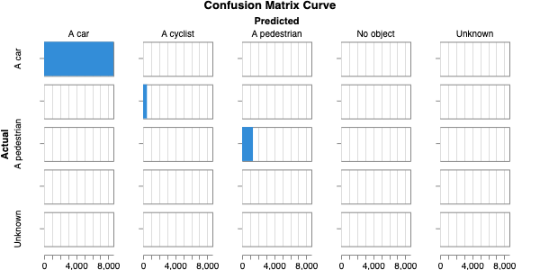
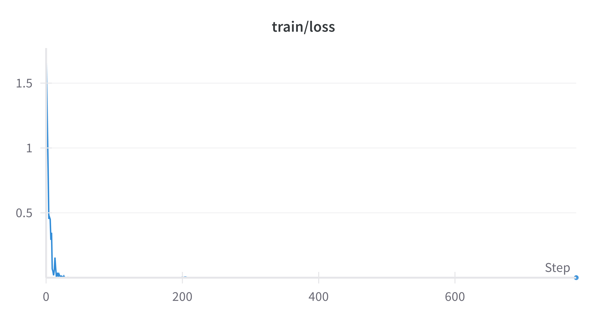
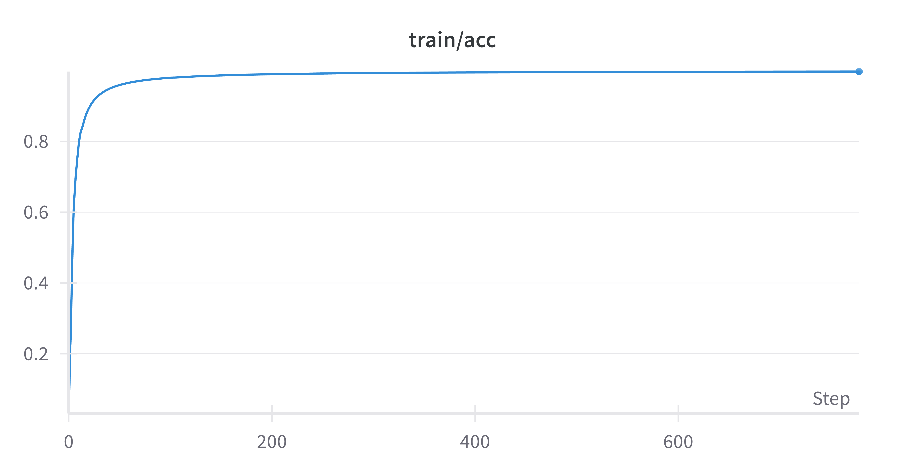

# LiDAR-Guided Visual Question Answering (VQA)

Multimodal system combining RGB images and LiDAR depth cues to answer questions about driving scenes using fine-tuned 
CLIP (ViT-B/32) and fusion strategies.

## Project Overview (ongoing)

This project implements a LiDAR-guided Visual Question Answering (VQA) system on the KITTI dataset. 
The system extends OpenAI's CLIP by incorporating LiDAR-derived depth maps, enabling it to answer both 
factual and spatial questions about driving scenes.

 <br/><br/>
 <br/><br/>

It includes support for:
- Fine-tuning CLIP with MLP and cross-attention fusion heads
- open-ended question handling
- [ongoing] Visualization of attention maps between image and text
- [ongoing] matrix-based intermediate fusion strategies
- [ongoing] paraphrased questions for natural language question answering 

## Architecture

- CLIP (ViT-B/32) as the base encoder for image and text
- [ongoing] LiDAR depth maps added as auxiliary signal
- Fusion Strategies:
  - Late Fusion via MLP head
  - Cross-Attention Fusion (bi-directional)
  - [ongoing] Intermediate Fusion (matrix-based)

## Installation
```
python3 -m venv .venv
source .venv/bin/activate
pip install -r requirements.txt
```

## Training
```
python train/clip_finetune.py
```

## Inference
[ongoing]
```
python scripts/clip_vqa_inference.py \
  --image path/to/image.png \
  --question "What is the object on the left?"
```

## Results

### Confusion Matrix
 <br/><br/>

### Training Curves
Training loss                    |       Training Accuracy
:-------------------------------:|:-------------------------:
   | 

### Citation

This project uses the CLIP model released by OpenAI:

> Radford et al. (2021), ["Learning Transferable Visual Models From Natural Language Supervision"](https://arxiv.org/abs/2103.00020).  
> Official GitHub repo: [https://github.com/openai/CLIP](https://github.com/openai/CLIP)
